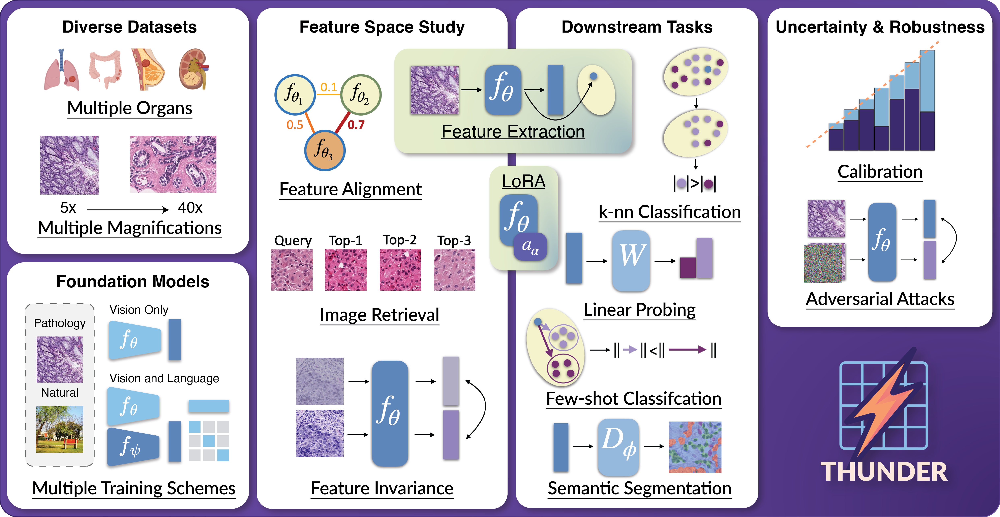

# Tile-level Histopathology image Understanding benchmark


We introduce **THUNDER**, a comprehensive benchmark designed to rigorously compare foundation models across various downstream tasks in computational pathology. THUNDER enables the evaluation and analysis of feature representations, robustness, and uncertainty quantification of these models across different datasets. Our benchmark encompasses a diverse collection of well-established datasets, covering multiple cancer types, image magnifications, and varying image and sample sizes. We propose an extensive set of tasks aimed at thoroughly assessing the capabilities and limitations of foundation models in digital pathology.


## Overview

We propose a benchmark to compare and study foundation models across three axes: (i) downstream task performance, (ii) feature space comparisons, and (iii) uncertainty and robustness. Our current version integrates 23 foundation models, vision-only, vision-language, trained on pathology or natural images, on 16 datasets covering different magnifications and organs. THUNDER also supports the use of new user-defined models for direct comparisons.




## Usage

An API and command line interface (CLI) are provided to allow users to download datasets, models, and run benchmarks. The API is designed to be user-friendly and allows for easy integration into existing workflows. The CLI provides a convenient way to access the same functionality from the command line.

!!!important
    **Downloading supported foundation models**: you will have to visit the Huggingface URL of supported models you wish to use in order to accept usage conditions.

<details>
<summary>List of Huggingface URLs</summary>

<ul>
  <li><a href="https://huggingface.co/MahmoodLab/UNI">UNI</a></li>
  <li><a href="https://huggingface.co/MahmoodLab/UNI2-h">UNI2-h</a></li>
  <li><a href="https://huggingface.co/paige-ai/Virchow">Virchow</a></li>
  <li><a href="https://huggingface.co/paige-ai/Virchow2">Virchow2</a></li>
  <li><a href="https://huggingface.co/bioptimus/H-optimus-0">H-optimus-0</a></li>
  <li><a href="https://huggingface.co/bioptimus/H-optimus-1">H-optimus-1</a></li>
  <li><a href="https://huggingface.co/MahmoodLab/CONCH">CONCH</a></li>
  <li><a href="https://huggingface.co/MahmoodLab/TITAN">TITAN/CONCHv1.5</a></li>
  <li><a href="https://huggingface.co/owkin/phikon">Phikon</a></li>
  <li><a href="https://huggingface.co/owkin/phikon-v2">Phikon2</a></li>
  <li><a href="https://huggingface.co/histai/hibou-b">Hibou-b</a></li>
  <li><a href="https://huggingface.co/histai/hibou-L">Hibou-L</a></li>
  <li><a href="https://huggingface.co/kaiko-ai/midnight">Midnight-12k</a></li>
  <li><a href="https://huggingface.co/Astaxanthin/KEEP">KEEP</a></li>
  <li><a href="https://huggingface.co/wisdomik/QuiltNet-B-32">QuiltNet-B-32</a></li>
  <li><a href="https://huggingface.co/vinid/plip">PLIP</a></li>
  <li><a href="https://huggingface.co/xiangjx/musk">MUSK</a></li>
  <li><a href="https://huggingface.co/facebook/dinov2-base">DINOv2-B</a></li>
  <li><a href="https://huggingface.co/facebook/dinov2-large">DINOv2-L</a></li>
  <li><a href="https://huggingface.co/google/vit-base-patch16-224-in21k">ViT-B</a></li>
  <li><a href="https://huggingface.co/google/vit-large-patch16-224-in21k">ViT-L</a></li>
  <li><a href="https://huggingface.co/openai/clip-vit-base-patch32">CLIP-B</a></li>
  <li><a href="https://huggingface.co/openai/clip-vit-large-patch14">CLIP-L</a></li>
</ul>

</details>

### API Usage
When using the API you can run the following code to download datasets, models and run a benchmark:

```python
from thunder import benchmark

benchmark("phikon", "break_his", "knn")
```

### CLI Usage
When using the CLI you can run the following command to see all available options,

```console
thunder --help
```

In order to reproduce the above example you can run the following command:

```console
thunder benchmark phikon break_his  knn
```

## Installing thunder

Code tested with Python 3.10. To replicate, you can create the following conda environment and activate it,
```console
conda create -n thunder_env python=3.10
conda activate thunder_env
```

To install `thunder` run the following command:

```console
pip install -e . # install the package in editable mode
pip install . # install the package
```

## Available datasets
|Name                | Benchmark name     | Labels   | Nb. classes | Organ(s) | Image size  | Magnification| Nb. images |
| :----------------- | :----------------: | :------: | :---------: | :------: | :---------: | :----------: | :--------: |
|BACH                | bach               | Classif. | 4           | Breast   | 1,536x2,048 | 20x          | 408        |
|BRACS               | bracs              | Classif. | 7           | Breast   | Variable    | 40x          | 4,539      |
|BreakHis            | break_his          | Classif. | 8           | Breast   | 700x460     | 40x          | 1,995      |
|Camelyon17 WILDS    | wilds              | Classif. | 2           | Breast   | 96x96       | 10x          | 302,436    |
|CCRCC               | ccrcc              | Classif. | 3           | Renal    | 300x300     | 40x          | 52,713     |
|CRC-100k            | crc                | Classif. | 9           | CRC      | 224x224     | 20x          | 107,180    |
|ESCA                | esca               | Classif. | 11          | Oeso.    | 256x256     | 10x          | 367,229    |
|MHIST               | mhist              | Classif. | 2           | CRC      | 224x224     | 5x           | 3,152      |
|Patch Camelyon      | patch_camelyon     | Classif. | 2           | Breast   | 96x96       | 10x          | 327,680    |
|TCGA CRC-MSI        | tcga_crc_msi       | Classif. | 2           | CRC      | 512x512     | 20x          | 51,918     |
|TCGA TILS           | tcga_tils          | Classif. | 2           | Multi    | 100x100     | 20x          | 304,097    |
|TCGA Uniform        | tcga_uniform       | Classif. | 32          | Multi    | 256x256     | 20x          | 271,170    |
|Ocelot              | ocelot             | Segm.    | 2           | Multi    | 256x256     | 40x          | 10,608     |
|PanNuke             | pannuke            | Segm.    | 6           | Multi    | 256x256     | 40x          | 7,901.     |
|SegPath Epithelial  | segpath_epithelial | Segm.    | 2           | Multi    | 256x256     | 40x          | 238,581    |
|SegPath Lymphocytes | segpath_lymphocytes| Segm.    | 2           | Multi    | 256x256     | 40x          | 110,457    |

## Supported foundation models
|Name        |Benchmark name          | Vision arch. | Params. | Training method | VLM | Pathology |
| :--------- | :--------------------: | :----------: | :-----: | :-------------: | :-: | :-------: |
|HIBOU-B     | hiboub                 | ViT-B/14     | 86M     | DINOv2          |     |x          |
|HIBOU-L     | hiboul                 | ViT-L/14     | 307M    | DINOv2          |     |x          |
|H-OPTIMUS-0 | hoptimus0              | ViT-G/14     | 1.1B    | DINOv2          |     |x          |
|H-OPTIMUS-1 | hoptimus1              | ViT-G/14     | 1.1B    | DINOv2          |     |x          |
|MIDNIGHT    | midnight               | ViT-G/14     | 1.1B    | DINOv2          |     |x          |
|PHIKON      | phikon                 | ViT-B/16     | 86M     | iBOT            |     |x          |
|PHIKON2     | phikon2                | ViT-L/16     | 307M    | DINOv2          |     |x          |
|UNI         | uni                    | ViT-L/16     | 307M    | DINOv2          |     |x          |
|UNI2-H      | uni2h                  | ViT-H/14     | 681M    | DINOv2          |     |x          |
|VIRCHOW     | virchow                | ViT-H/14     | 632M    | DINOv2          |     |x          |
|VIRCHOW2    | virchow2               | ViT-H/14     | 632M    | DINOv2          |     |x          |
|CONCH       | conch                  | ViT-B/16     | 86M     | CoCa, iBOT      |x    |x          |
|CONCH 1.5   | titan                  | ViT-L/16     | 307M    | CoCa            |x    |x          |
|KEEP        | keep                   | ViT-L/16     | 307M    | CLIP            |x    |x          |
|MUSK        | musk                   | V-FFN        | 202M    | CoCa, BEiT-3    |x    |x          |
|PLIP        | plip                   | ViT-B/32     | 86M     | CLIP            |x    |x          |
|QUILTNET    | quiltnetb32            | ViT-B/32     | 86M     | CLIP            |x    |x          |
|DINOv2-B    | dinov2base             | ViT-B/14     | 86M     | DINOv2          |     |           |
|DINOv2-L    | dinov2large            | ViTL/14      | 307M    | DINOv2          |     |           |
|ViT-B/16    | vitbasepatch16224in21k | ViT-B/16     | 86M     | Imagenet        |     |           |
|ViT-L/16    | vitlargepatch16224in21k| ViT-L/16     | 307M    | Imagenet        |     |           |
|CLIP-B/32   | clipvitbasepatch32     | ViT-B/32     | 86M     | CLIP            |x    |           |
|CLIP-L/14   | clipvitlargepatch14    | ViT-L/14     | 307M    | CLIP            |x    |           |